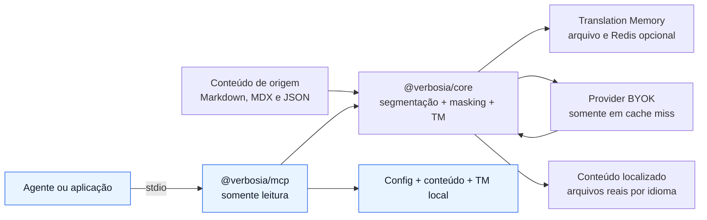

<p align="center">
  
</p>

# Verbosia

**Núcleo open source de localização multilíngue para conteúdo estático, com tradução assistida por IA, Translation Memory, revisão humana, SEO técnico e uma camada MCP local e segura.**

O Verbosia transforma conteúdo Markdown/MDX em páginas reais por idioma. Ele segmenta o texto, protege código e estruturas, reaproveita traduções anteriores, consulta o provider somente quando necessário e mantém o resultado revisável no Git.

O MCP adiciona uma interface padronizada para agentes e aplicações inspecionarem um projeto e planejarem sua localização sem escrever arquivos, acessar Redis ou chamar APIs de tradução.

> [!IMPORTANT]
> **Estado atual do produto:** tradução, revisão, Translation Memory, SEO e as duas tools MCP read-only estão implementados. Brand Memory, Evidence Ledger e validação determinística de Claims possuem arquitetura, SPEC e stories aprovadas, mas ainda não estão disponíveis no runtime.

> [!NOTE]
> **Distribuição em 27 de agosto de 2026:** os pacotes `verbosia` e `@verbosia/*` ainda não estão publicados no npm. O uso funcional atual é feito a partir deste repositório compilado. Os comandos de instalação pelo registry representam o fluxo previsto para a primeira publicação.

## Sumário

- [O que já funciona](#o-que-já-funciona)
- [Como o Verbosia funciona](#como-o-verbosia-funciona)
- [Pacotes do monorepo](#pacotes-do-monorepo)
- [Requisitos e instalação atual](#requisitos-e-instalação-atual)
- [Início rápido da tradução](#início-rápido-da-tradução)
- [Configuração completa](#configuração-completa)
- [Comandos da CLI](#comandos-da-cli)
- [Translation Memory](#translation-memory)
- [Provedores](#provedores)
- [Revisão humana](#revisão-humana)
- [SEO multilíngue](#seo-multilíngue)
- [Integrações com frameworks](#integrações-com-frameworks)
- [MCP local](#mcp-local)
- [API programática do Core](#api-programática-do-core)
- [Segurança e limites](#segurança-e-limites)
- [Brand Memory e Evidence Ledger](#brand-memory-e-evidence-ledger)
- [Roadmap de implementação](#roadmap-de-implementação)
- [Desenvolvimento e testes](#desenvolvimento-e-testes)
- [Solução de problemas](#solução-de-problemas)
- [Documentação complementar](#documentação-complementar)

## O que já funciona

| Capacidade | Estado | Resultado |
| --- | --- | --- |
| Tradução de Markdown, MDX e Markdown longo | Disponível | Arquivos localizados em `outputDir/<lang>/...` |
| Segmentação por parágrafo | Disponível | Editar um bloco não invalida o documento inteiro |
| Masking estrutural | Disponível | Código, URLs, variáveis e tags MDX são preservados |
| Translation Memory em arquivo | Disponível | Cache versionável em `.verbosia/tm.json` |
| Translation Memory com Redis | Disponível | Reuso opcional e backfill entre projetos confiáveis |
| Anthropic, OpenAI, Gemini e DeepL | Disponível | Interface única com credenciais BYOK |
| Tradução de frontmatter aninhado | Disponível | Dot-notation e wildcard para folhas `string` |
| Strings de UI em JSON | Disponível | Geração de um dicionário por idioma |
| Revisão humana local | Disponível | Edições voltam para a TM e sobrevivem a novos runs |
| Slugs localizados estáveis | Disponível | Mapa comitável em `.verbosia/slugs.json` |
| SEO técnico multilíngue | Disponível | canonical, hreflang, x-default, OpenGraph, JSON-LD e sitemap |
| Astro, Eleventy e Next.js | Disponível | Adapters e helpers específicos por framework |
| MCP `inspect_project` | Disponível | Estado multilíngue estruturado do projeto |
| MCP `plan_localization` | Disponível | Estimativa local de hits e chamadas de API |
| Brand Memory + overlays | Especificado | Implementação organizada nas Stories 1–3 |
| Evidence Ledger + Policy Engine | Especificado | Implementação organizada nas Stories 4–5 |
| MCP `inspect_brand_context` e `validate_claims` | Especificado | Integração prevista na Story 6 |
| Context Packs de idioma/SEO/GEO | Contrato planejado | V1 publicará o schema; runtime e catálogo são futuros |
| Plugin WordPress | Futuro | Não faz parte da V1 de Brand Memory/Evidence Ledger |
| Market Signals e conectores externos | Futuro | Iniciativa separada, com consentimento, TTL e isolamento |

O Verbosia melhora a qualidade técnica e a consistência da localização. Ele **não promete ranking, tráfego, citação em respostas generativas ou comportamento de buscadores**.

## Como o Verbosia funciona

Existem dois fluxos com limites diferentes:



- **CLI e adapters:** podem chamar providers, gravar traduções, atualizar a TM, gerar slugs e produzir sitemap.
- **MCP atual:** apenas lê o projeto autorizado, calcula status e estima trabalho. Não traduz, não grava e não usa rede.

### Pipeline de tradução

1. Descobre arquivos `.md`, `.mdx` e `.markdown` nas coleções configuradas.
2. Divide o corpo em documento inteiro ou blocos de parágrafo.
3. Converte campos de frontmatter selecionados e strings de UI em segmentos.
4. Mascara código, URLs, `{variáveis}`, links e tags MDX/HTML.
5. Calcula a chave de Translation Memory.
6. Procura no arquivo local, depois no Redis opcional.
7. Em cache miss, chama o provider com a chave BYOK.
8. Valida se todos os tokens protegidos sobreviveram.
9. Restaura a estrutura e grava o conteúdo localizado.
10. Registra rastreabilidade e estado de revisão no frontmatter.

## Pacotes do monorepo

| Pacote | Responsabilidade | Runtime declarado atualmente |
| --- | --- | --- |
| [`@verbosia/core`](packages/core) | Domínio, discovery, tradução, TM, revisão, SEO e contratos | Node.js `>=18` |
| [`verbosia`](packages/cli) | CLI de tradução, status, revisão e manutenção | Node.js `>=18` |
| [`@verbosia/mcp`](packages/mcp) | Servidor MCP local por `stdio` | Node.js `>=20` |
| [`@verbosia/astro`](packages/astro) | Integração de build e SEO para Astro | Node.js `>=18`, Astro `>=4` |
| [`@verbosia/eleventy`](packages/eleventy) | Plugin de build e SEO para Eleventy | Node.js `>=18` |
| [`@verbosia/next`](packages/next) | Tradução programática e Metadata API para Next.js | Node.js `>=18` |

A release de Brand Memory + Evidence Ledger elevará Core e MCP para Node.js `>=22`, com testes em Node 22 e 24. Até essa migração ser implementada, o CI existente continua em Node 20.

## Requisitos e instalação atual

### Requisitos recomendados

- Node.js 20 ou superior para usar todo o projeto atual, incluindo MCP.
- pnpm 10.33.2, conforme `packageManager` do repositório.
- Git.
- Uma chave do provider apenas quando houver cache miss de tradução.
- Redis somente se o Tier 2 compartilhado for desejado.

### Clonar e compilar

```bash
git clone https://github.com/edbentto22/verbosia.git
cd verbosia
corepack enable
pnpm install --frozen-lockfile
pnpm build
pnpm typecheck
pnpm test
```

Os binários compilados ficam em:

```text
packages/cli/dist/cli.js
packages/mcp/dist/stdio.js
```

### Usar a CLI compilada em outro projeto

```bash
export VERBOSIA_REPO=/caminho/absoluto/para/verbosia
cd /caminho/absoluto/para/meu-site

node "$VERBOSIA_REPO/packages/cli/dist/cli.js" status
node "$VERBOSIA_REPO/packages/cli/dist/cli.js" translate --dry-run
```

### Após a publicação no npm

Estes serão os comandos de instalação convencionais, mas eles ainda não funcionam no registry enquanto os pacotes não forem publicados:

```bash
pnpm add -D verbosia @verbosia/core @verbosia/mcp
pnpm add @anthropic-ai/sdk
```

## Início rápido da tradução

### 1. Crie a configuração

Na raiz do site que será localizado, crie `verbosia.config.mjs`:

```js
/** @type {import('@verbosia/core').VerbaUserConfig} */
export default {
  provider: 'anthropic',
  source: 'pt',
  targets: ['en', 'es'],
  variant: { en: 'en-US', es: 'es-419' },
  collections: ['blog'],
  glossary: ['Minha Marca', 'Chapada Diamantina'],
  doNotTranslate: ['Verbosia'],
};
```

O loader aceita, nesta ordem, `verbosia.config.mjs`, `verbosia.config.js` ou `verbosia.config.json`.

### 2. Organize o conteúdo

```text
src/content/
└── blog/
    └── chapada.md
```

```md
---
title: Um fim de semana na Chapada Diamantina
description: Roteiro de três dias.
slug: fim-de-semana-chapada
---

A **Chapada Diamantina** é um dos destinos mais bonitos do Brasil.

Reserve pela [nossa página](https://example.com/reservas) ou rode `npm run book`.
```

### 3. Configure a chave BYOK

```bash
export ANTHROPIC_API_KEY=sk-ant-...
# ou OPENAI_API_KEY, GEMINI_API_KEY, GOOGLE_API_KEY,
# DEEPL_API_KEY ou DEEPL_AUTH_KEY
```

Nunca comite a chave. O `.gitignore` já exclui `.env` e `.env.*`, preservando apenas `.env.example`.

### 4. Planeje antes de gastar

```bash
node "$VERBOSIA_REPO/packages/cli/dist/cli.js" translate --dry-run
```

O dry-run informa hits e chamadas estimadas sem chamar provider nem gravar arquivos localizados. Com `cache.driver: 'redis'`, porém, a CLI pode consultar o Redis e um hit no Tier 2 pode fazer backfill em `.verbosia/tm.json`; para planejamento estritamente local e sem escrita, use `verbosia.plan_localization` no MCP.

### 5. Traduza

```bash
node "$VERBOSIA_REPO/packages/cli/dist/cli.js" translate
```

Resultado:

```text
src/content/
├── blog/chapada.md
├── en/blog/chapada.md
├── es/blog/chapada.md
└── .verbosia/
    └── tm.json
```

Cada arquivo localizado recebe metadados semelhantes a:

```yaml
verbosia:
  sourceHash: 3d5d1c82a9396292
  translatedBy: claude-sonnet-5
  translatedAt: '2026-08-27T12:00:00.000Z'
  reviewed: false
  lang: en
```

### 6. Revise e comite

```bash
node "$VERBOSIA_REPO/packages/cli/dist/cli.js" review
git add src/content
git commit -m "content: localize site with Verbosia"
```

Comite os arquivos localizados, `.verbosia/tm.json` e, quando habilitado, `.verbosia/slugs.json`.

## Configuração completa

```js
/** @type {import('@verbosia/core').VerbaUserConfig} */
export default {
  provider: 'anthropic',
  model: 'claude-sonnet-5',

  source: 'pt',
  targets: ['en', 'es'],
  variant: { en: 'en-US', es: 'es-419' },
  tone: 'acolhedor, claro e objetivo',

  collections: ['blog', 'pages'],
  contentDir: 'src/content',
  outputDir: 'src/content',
  translateFields: [
    'title',
    'description',
    'hero.title',
    'sections.*.heading',
  ],

  glossary: ['Chapada Diamantina'],
  doNotTranslate: ['Verbosia'],
  segmentation: 'paragraph',
  localizeSlugs: false,
  uiStrings: 'src/i18n/pt.json',

  limits: {
    retries: 3,
    concurrency: 4,
    maxApiCalls: 0,
  },

  cache: {
    driver: process.env.REDIS_URL ? 'redis' : 'file',
    url: process.env.REDIS_URL,
    committed: true,
  },

  seo: {
    hreflang: true,
    sitemap: true,
    xDefault: 'pt',
    canonical: true,
  },
};
```

### Referência dos campos

| Campo | Obrigatório | Default | Função |
| --- | --- | --- | --- |
| `source` | Sim | — | Idioma de origem |
| `targets` | Sim | — | Idiomas que serão gerados; não pode conter `source` |
| `provider` | Não | `anthropic` | `anthropic`, `openai`, `gemini` ou `deepl` |
| `model` | Não | Depende do provider | Modelo usado e incluído na chave da TM |
| `variant` | Não | `{}` | Variante BCP-47 por idioma, como `en-US` |
| `tone` | Não | — | Orientação de tom enviada a providers que aceitam prompt |
| `collections` | Não | `[]` | Primeiro segmento sob `contentDir`; vazio inclui todas |
| `contentDir` | Não | `src/content` | Diretório de origem |
| `outputDir` | Não | `src/content` | Diretório que recebe `<lang>/...` e `.verbosia/` |
| `translateFields` | Não | `['title', 'description']` | Campos de frontmatter traduzíveis |
| `glossary` | Não | `[]` | Termos preservados de forma idêntica |
| `doNotTranslate` | Não | `[]` | Lista explícita de nunca traduzir |
| `segmentation` | Não | `paragraph` | `paragraph` ou `document` |
| `localizeSlugs` | Não | `false` | Gera e fixa slugs por idioma |
| `uiStrings` | Não | `null` | JSON de origem para strings de interface |
| `limits.retries` | Não | `3` | Retentativas extras em erros transitórios |
| `limits.concurrency` | Não | `4` | Segmentos processados em paralelo |
| `limits.maxApiCalls` | Não | `0` | Limite lógico por run; `0` significa ilimitado |
| `cache.driver` | Não | `file` | Ativa arquivo local ou cascata com Redis |
| `cache.url` | Com Redis | — | URL do Redis |
| `cache.committed` | Não | `true` | Mantém o Tier 1 em arquivo |
| `seo.hreflang` | Não | `true` | Habilita alternates por idioma |
| `seo.sitemap` | Não | `true` | Habilita geração de sitemap nos adapters |
| `seo.xDefault` | Não | `source` | Idioma apontado por `x-default` |
| `seo.canonical` | Não | `true` | Habilita canonical por locale |

### Frontmatter aninhado

`translateFields` aceita dot-notation e `*`:

```js
translateFields: [
  'title',
  'hero.title',
  'faq.*.question',
  'faq.*.answer',
  'sections.*.heading',
]
```

Somente folhas `string` são traduzidas. Objetos, arrays, imagens, datas, números, ícones e campos não selecionados preservam a estrutura. Chaves cujo nome contém ponto não são endereçáveis.

### Strings de UI

Com `uiStrings: 'src/i18n/pt.json'`, cada folha `string` vira um segmento e o Verbosia gera `en.json`, `es.json` e demais alvos no mesmo diretório. Objetos, arrays, números, booleanos e `null` mantêm sua forma; variáveis ICU como `{name}` passam pelo masking.

## Comandos da CLI

| Comando | Escreve? | Usa provider? | Exit code relevante |
| --- | --- | --- | --- |
| `verbosia translate` | Sim | Somente em cache miss | `0` em sucesso; `1` em erro |
| `verbosia translate --dry-run` | Não grava conteúdo; pode fazer backfill da TM via Redis | Não; pode acessar Redis | `0` em sucesso |
| `verbosia status` | Não | Não | `0` se não há `missing/stale`; `1` caso contrário |
| `verbosia prune --dry-run` | Não | Não | `0` em sucesso |
| `verbosia prune` | Sim, remove órfãos | Não | `0` em sucesso |
| `verbosia tm:sync` | Sim, arquivo e Redis | Não traduz | `0` em sucesso |
| `verbosia review [--port 5199]` | Sim, ao salvar | Não traduz | Permanece ativo até `Ctrl+C` |
| `verbosia help` | Não | Não | `0` |
| Comando desconhecido | Não | Não | `2` |

### `translate`

Descobre documentos, resolve segmentos pela TM e grava as versões localizadas. A tradução é idempotente para a mesma combinação de texto, alvo, modelo, glossário e versão de prompt.

### `status`

- `fresh`: o `sourceHash` localizado corresponde à origem atual.
- `stale`: a origem mudou desde a tradução.
- `missing`: ainda não existe arquivo localizado.
- `[não revisado]`: o arquivo existe, mas `reviewed` não é `true`.

O estado de revisão não altera sozinho o exit code.

> [!CAUTION]
> Na implementação atual, `sourceHash` é calculado sobre o corpo do documento. Uma alteração somente em campos de frontmatter pode não aparecer como `stale` antes do próximo `translate`, embora a chave de TM do campo alterado seja recalculada durante a tradução.

### `prune`

Remove arquivos localizados cuja origem deixou de existir e chaves da TM local sem uso vivo. O Redis nunca é podado. Comece sempre com `--dry-run`.

### `tm:sync`

Faz a união entre arquivo e Redis, escolhendo a entrada de timestamp mais recente. Exige `cache.driver: 'redis'` e `cache.url`.

### `review`

Abre o editor em `127.0.0.1`. A porta padrão é `5199` e pode ser alterada com `--port`.

## Translation Memory

A chave de cache é:

```text
sha256(sourceText | targetLang | model | glossaryVersion | promptVersion)
```

Isso significa:

| Mudança | Efeito |
| --- | --- |
| Nenhuma mudança | 100% de hits possíveis |
| Um parágrafo editado | Só aquele segmento recebe chave nova |
| Modelo alterado | Traduções antigas permanecem e a nova versão ganha outras chaves |
| Glossário alterado | O `glossaryVersion` muda |
| Prompt do produto versionado | As entradas afetadas são invalidadas |

### Cascata de resolução

```text
Tier 1: outputDir/.verbosia/tm.json
        ↓ miss
Tier 2: Redis opcional
        ↓ miss
Provider BYOK
```

- Hit no arquivo: uso imediato.
- Hit no Redis: uso imediato e backfill no arquivo quando o Tier 1 está ativo.
- Miss total: provider e write-through nos tiers configurados.
- Bloco sem prosa: passthrough, sem TM e sem API.

O arquivo `tm.json` é serializado com chaves ordenadas para produzir diffs estáveis.

> [!CAUTION]
> O Redis compartilha traduções por chave de conteúdo e não implementa isolamento por cliente. Use apenas entre projetos confiáveis e com direitos compatíveis sobre o conteúdo; prefira instâncias ou namespaces separados quando houver confidencialidade ou separação entre clientes.

## Provedores

| Provider | Chave | Modelo default no código | Dependência |
| --- | --- | --- | --- |
| Anthropic | `ANTHROPIC_API_KEY` | `claude-sonnet-5` | `@anthropic-ai/sdk` |
| OpenAI | `OPENAI_API_KEY` | `gpt-4o` | `openai` |
| Gemini | `GEMINI_API_KEY` ou `GOOGLE_API_KEY` | `gemini-2.0-flash` | `@google/genai` |
| DeepL | `DEEPL_API_KEY` ou `DEEPL_AUTH_KEY` | `deepl` | `fetch` nativo |

Características comuns:

- Credenciais BYOK por variável de ambiente.
- Retry uniforme para `408`, `409`, `429`, `500`, `502`, `503`, `504`, `529` e falhas de rede conhecidas.
- Backoff exponencial com jitter.
- Orçamento por chamadas lógicas; retries não contam novamente.
- Masking e validação estrutural antes de aceitar o resultado.

Anthropic, OpenAI e Gemini recebem um prompt compartilhado com alvo, variante, tom, glossário e regras de preservação. DeepL usa XML com tags ignoradas para proteger tokens e termos; `tone` não se aplica ao DeepL.

## Revisão humana

```bash
node "$VERBOSIA_REPO/packages/cli/dist/cli.js" review
```

O editor local oferece:

- lista de documentos e idiomas;
- badges `fresh`, `stale` e `missing`;
- origem somente leitura;
- corpo e frontmatter traduzidos editáveis;
- ação de salvar;
- ação de salvar e marcar como revisado.

Ao salvar, o Verbosia atualiza o arquivo e as entradas correspondentes da TM. Se o revisor dividir ou fundir parágrafos, o arquivo é preservado, mas a atualização da TM do corpo é ignorada porque o pareamento deixou de ser seguro.

Quando um novo `translate` gera conteúdo idêntico ao aprovado, `reviewed` e `reviewedAt` são preservados. Quando a origem altera a tradução, `reviewed` volta a `false`.

## SEO multilíngue

O Core e os adapters podem gerar:

- `<html lang>` com variante BCP-47;
- canonical por locale;
- `hreflang` recíproco por locale;
- `hreflang="x-default"`;
- `og:locale` e `og:locale:alternate`;
- JSON-LD `WebPage` com `inLanguage`;
- `sitemap-i18n.xml` com alternates;
- slugs localizados estáveis.

O padrão de rota do sitemap é:

```text
origem: /{collection}/{slug}
alvos:  /{lang}/{collection}/{slug}
```

Adapters aceitam um `route` customizado quando a aplicação possui outro padrão.

Com `localizeSlugs: true`, o slug nasce do título traduzido e é fixado em `.verbosia/slugs.json`. Alterações posteriores do título não mudam automaticamente a URL. Para renomear, edite o mapa deliberadamente e configure redirecionamento 301.

SEO técnico correto aumenta a clareza para crawlers, mas não garante posicionamento. A camada futura de GEO/SEO trabalhará com regras e evidências, também sem prometer ranking.

## Integrações com frameworks

### Astro

`@verbosia/astro`:

- traduz em `astro:build:start` quando `runOnBuild` é `true`;
- não traduz durante `astro dev`;
- gera `sitemap-i18n.xml` em `astro:build:done` quando `site` está configurado;
- oferece `verbosiaHead()` para canonical, hreflang, OpenGraph e JSON-LD.

### Eleventy

`@verbosia/eleventy`:

- traduz em `eleventy.before`;
- gera sitemap em `eleventy.after`;
- registra os filtros `verbosiaHead` e `verbosiaHreflang`;
- registra global data `{ source, targets, variant }`.

### Next.js

`@verbosia/next`:

- executa tradução via `verbosia translate` em `prebuild` ou `verbosiaTranslate()`;
- oferece `verbosiaAlternates()` para o Metadata API;
- reexporta `buildSitemapXml()` para scripts de prebuild.

Guias completos estão em [`docs/frameworks`](docs/frameworks).

## MCP local

O MCP atual é um servidor local por `stdio`. Ele recebe uma raiz absoluta na inicialização e expõe duas tools sem argumentos.

### Compilar o MCP

```bash
pnpm --filter @verbosia/core build
pnpm --filter @verbosia/mcp build
```

### Configurar um host MCP hoje

Use caminhos absolutos:

```json
{
  "mcpServers": {
    "verbosia": {
      "command": "node",
      "args": [
        "/caminho/absoluto/verbosia/packages/mcp/dist/stdio.js",
        "--root",
        "/caminho/absoluto/meu-site"
      ]
    }
  }
}
```

Após a publicação do pacote, o processo será equivalente a:

```json
{
  "mcpServers": {
    "verbosia": {
      "command": "verbosia-mcp",
      "args": ["--root", "/caminho/absoluto/meu-site"]
    }
  }
}
```

Formas aceitas de raiz:

```bash
verbosia-mcp --root /projetos/site
verbosia-mcp --root=/projetos/site
```

A raiz deve ser absoluta e ser o único argumento. Caminhos relativos, flags extras ou raiz ausente são rejeitados.

### `verbosia.inspect_project`

**Input:** `{}` estrito.

**Finalidade:** retornar a configuração pública, o estado por documento/idioma e um resumo.

```json
{
  "project": {
    "source": "pt",
    "targets": ["en", "es"],
    "variants": { "en": "en-US", "es": "es-419" },
    "provider": "anthropic",
    "model": "claude-sonnet-5",
    "collections": ["blog"]
  },
  "rows": [
    {
      "docId": "blog/chapada",
      "collection": "blog",
      "targetLang": "en",
      "state": "fresh",
      "reviewed": true
    }
  ],
  "summary": {
    "total": 2,
    "missing": 0,
    "stale": 0,
    "fresh": 2,
    "unreviewed": 1
  }
}
```

### `verbosia.plan_localization`

**Input:** `{}` estrito.

**Finalidade:** consultar somente a TM em arquivo e estimar o trabalho restante.

```json
{
  "documents": 1,
  "source": "pt",
  "targets": ["en", "es"],
  "provider": "anthropic",
  "model": "claude-sonnet-5",
  "hits": 8,
  "estimatedApiCalls": 2,
  "uiKeys": 0,
  "items": [
    {
      "docId": "blog/chapada",
      "targetLang": "en",
      "segments": 5,
      "hits": 4,
      "estimatedApiCalls": 1
    }
  ],
  "readOnly": true,
  "cacheScope": "local-file"
}
```

Passthrough de código ou URL pura não é contado como hit da TM nem como chamada estimada.

### Garantias do MCP atual

- Não escreve arquivos.
- Não chama provider.
- Não acessa Redis.
- Não abre conexão de rede pelo código de análise.
- Não retorna credenciais, URL do Redis ou paths internos nos resultados normais.
- Rejeita `contentDir`, `outputDir`, `uiStrings`, TM e conteúdo localizado que escapem da raiz.
- Detecta escapes lexicais e por symlink.
- Mantém `stdout` exclusivo para o protocolo; logs da config são redirecionados a `stderr`.
- Retorna o mesmo objeto em `text` JSON e `structuredContent`.

### Códigos de erro estáveis

| Código | Significado |
| --- | --- |
| `PROJECT_ROOT_REQUIRED` | Raiz ausente, relativa ou argumentos ambíguos |
| `PROJECT_ROOT_NOT_FOUND` | Raiz inexistente ou não é diretório |
| `CONFIG_NOT_FOUND` | Nenhum arquivo de configuração aceito foi encontrado |
| `CONFIG_ACCESS_FAILED` | A configuração não pôde ser acessada |
| `ROOT_BOUNDARY_VIOLATION` | Caminho ou symlink escapou da raiz autorizada |
| `ANALYSIS_FAILED` | Falha inesperada sanitizada, sem stack ou detalhes internos |

> [!WARNING]
> `verbosia.config.mjs` e `.js` são módulos executáveis. O MCP confia no código da configuração contida na raiz autorizada; não aponte `--root` para repositórios desconhecidos. Use `verbosia.config.json` quando precisar de configuração estritamente declarativa.

### O que o MCP ainda não faz

O MCP atual não traduz conteúdo, não revisa, não publica, não recebe texto para localização, não consulta SEO/GEO externo e não possui Brand Memory ou Evidence Ledger no runtime. Essas capacidades não devem ser simuladas por uma aplicação consumidora.

## API programática do Core

```ts
import { resolveConfig, translate } from '@verbosia/core';

const config = resolveConfig(
  {
    provider: 'anthropic',
    source: 'pt',
    targets: ['en', 'es'],
    collections: ['blog'],
  },
  '/caminho/absoluto/meu-site',
);

const report = await translate(config, { dryRun: true });
console.log(report.hits, report.misses);
```

Principais grupos de exports:

| Área | Exports principais |
| --- | --- |
| Configuração segura | `resolveConfig`, `loadProjectConfig`, `resolveProjectRoot`, `assertWithinProjectRoot` |
| Conteúdo | `discover`, `segment`, `splitBody`, `localizedPath` |
| Tradução | `translate`, `planTranslation`, `resolveSegment` |
| TM | `cacheKey`, `FileCacheDriver`, `RedisCacheDriver`, `syncTM`, `prune` |
| Providers | `AnthropicProvider`, `OpenAIProvider`, `GeminiProvider`, `DeepLProvider` |
| Revisão | `getReviewDoc`, `applyReview` |
| SEO | `buildHeadSeo`, `buildSitemapXml`, `htmlLang`, `hreflangTags` |
| Slugs | `slugify`, `resolveSlug`, `loadSlugMap`, `saveSlugMap` |
| UI | `translateUIStrings`, `flattenStrings` |
| Operação | `withRetry`, `CallBudget`, `mapLimit` |

## Segurança e limites

### Credenciais

- Chaves de provider vêm de variáveis de ambiente.
- Nenhuma chave deve entrar na config comitada.
- A CLI só carrega o SDK do provider ativo.
- O MCP não retorna chaves e não instancia providers.

### Integridade estrutural

O masking protege:

- blocos de código cercados;
- código inline;
- tags e componentes HTML/MDX;
- expressões entre chaves;
- URLs de links Markdown;
- URLs cruas.

Se um token `⟦VERBOSIA_N⟧` desaparecer durante a tradução, o segmento é descartado com erro em vez de produzir conteúdo estruturalmente corrompido.

### Limites operacionais da tradução

- `limits.retries` evita desistir em falhas transitórias.
- `limits.concurrency` controla pressão sobre o provider.
- `limits.maxApiCalls` interrompe antes da próxima chamada quando o orçamento termina.
- Segmentos já pagos permanecem na TM; um novo run continua do ponto anterior.

### Limite de confiança local

O MCP protege a boundary do filesystem, mas não é um sandbox para código malicioso presente na configuração JS. O modelo de ameaça atual pressupõe uma máquina local e uma raiz de projeto confiável.

## Brand Memory e Evidence Ledger

Esta é a próxima evolução aprovada do MCP. Ela separa quatro domínios:

| Memória | Conteúdo | Estado |
| --- | --- | --- |
| Translation Memory | Traduções aprovadas por segmento | Implementada |
| Brand Memory | Identidade, tom, públicos, ofertas, terminologia, restrições e Claims | Especificada |
| Evidence Ledger | Proveniência, permissão, escopo, validade e suporte de evidências | Especificado |
| Market Signals | Dores, linguagem, objeções e temas transitórios | Futuro |

### Arquivos canônicos planejados

```text
.verbosia/
├── brand/
│   └── brand-memory.json
└── evidence/
    └── <evidence-id>.json
```

### Tools MCP planejadas

| Tool | Estado | Papel |
| --- | --- | --- |
| `verbosia.inspect_project` | Implementada | Estado multilíngue do projeto |
| `verbosia.plan_localization` | Implementada | Plano local baseado na TM |
| `verbosia.inspect_brand_context` | Planejada | Contexto de marca resolvido e sanitizado |
| `verbosia.validate_claims` | Planejada | Autorização determinística e explicável de Claims |

A decisão de Claim seguirá resultados ordenados:

```text
allow < allow_with_constraints < review_required < block
```

IA poderá extrair ou sugerir correspondências, mas não autorizar comunicação. A autorização pertencerá ao Policy Engine determinístico, usando evidência atual, permitida e aplicável.

### Contratos planejados

A V1 publicará JSON Schemas Draft 2020-12 para Brand Memory, Evidence Record, Policy Rule, contexto resolvido, validação de Claims, diagnósticos e `ContextPackContribution`. Os mesmos contratos deverão ser consumíveis por Node, PHP/WordPress e futuros adapters.

Context Packs serão apenas declarativos na V1: sem código executável, catálogo, carregamento remoto ou acesso a dados privados do cliente.

Documentos normativos:

- [SPEC Brand Memory + Evidence Ledger](./_bmad-output/specs/spec-brand-memory-evidence-ledger/SPEC.md)
- [Matriz de aceitação](./_bmad-output/specs/spec-brand-memory-evidence-ledger/acceptance-matrix.md)
- [Architecture Spine](./_bmad-output/planning-artifacts/architecture/architecture-VERBOSIA-2026-08-27/ARCHITECTURE-SPINE.md)
- [Backlog de stories](./_bmad-output/specs/spec-brand-memory-evidence-ledger/stories.yaml)

## Roadmap de implementação

| Ordem | Story | Resultado esperado |
| --- | --- | --- |
| 1 | Publicar contratos e schemas portáteis | JSON Schema, tipos, exports e golden fixtures |
| 2 | Construir snapshot local seguro | Boundary, symlink, TOCTOU, I-JSON/JCS e digests |
| 3 | Implementar Brand Memory e overlays | Memória canônica e contexto resolvido |
| 4 | Implementar Evidence Ledger | Permissão default-deny, supersession e quarentena |
| 5 | Implementar Policy Engine determinístico | PolicyDecisionTable, reason codes e overrides |
| 6 | Expor tools MCP aditivas | Quatro tools mantendo compatibilidade legada |
| 7 | Provar portabilidade e hardening | Node 22/24, PHP, canários e três locales |
| 8 | Validar cenário E2E iterativo | Cenário real, correções e regressões permanentes |

WordPress, Market Signals, conectores Google/CRM/social, OAuth, transporte remoto e publicação automática são iniciativas posteriores; não fazem parte dessas oito stories.

## Desenvolvimento e testes

### Comandos do monorepo

```bash
pnpm install --frozen-lockfile
pnpm build
pnpm typecheck
pnpm test
pnpm test:watch
```

### Executar uma suíte específica

```bash
pnpm vitest run packages/mcp/test/protocol.test.ts
pnpm vitest run packages/core/test/translation-plan.test.ts
```

### Builds por pacote

```bash
pnpm --filter @verbosia/core build
pnpm --filter verbosia build
pnpm --filter @verbosia/mcp build
pnpm --filter @verbosia/astro build
pnpm --filter @verbosia/eleventy build
pnpm --filter @verbosia/next build
```

### Estrutura do repositório

```text
verbosia/
├── packages/
│   ├── core/          # domínio e APIs provider-neutral
│   ├── cli/           # binário verbosia
│   ├── mcp/           # servidor stdio read-only
│   ├── astro/         # integração Astro
│   ├── eleventy/      # plugin Eleventy
│   └── next/          # helpers Next.js
├── examples/blog-pt/  # exemplo funcional pt → en/es
├── docs/              # guias e especificações
├── _bmad-output/      # arquitetura, SPEC e backlog da próxima evolução
└── .github/workflows/ # CI
```

### CI atual

O workflow executa instalação com lockfile congelado, build, typecheck, testes e smoke tests offline da CLI no exemplo. A migração da próxima release ampliará a matriz para Node 22 e 24.

## Solução de problemas

### `CONFIG_NOT_FOUND`

Crie `verbosia.config.mjs`, `.js` ou `.json` na raiz usada pela CLI ou pelo `--root` do MCP.

### `PROJECT_ROOT_REQUIRED`

O MCP exige exatamente uma raiz absoluta:

```bash
node /abs/verbosia/packages/mcp/dist/stdio.js --root /abs/meu-site
```

### `ROOT_BOUNDARY_VIOLATION`

Verifique `contentDir`, `outputDir`, `uiStrings`, idiomas de destino e symlinks. No MCP, tudo precisa permanecer dentro da raiz real autorizada.

### Chave de API ausente

Defina a variável correspondente ao provider. `status`, MCP e dry-run não precisam de chave de tradução, mas a CLI em dry-run pode acessar Redis quando esse driver estiver configurado. `translate` precisa da chave quando houver cache miss.

### SDK do provider ausente

Instale somente a dependência utilizada:

```bash
pnpm add @anthropic-ai/sdk
pnpm add openai
pnpm add @google/genai
```

DeepL usa `fetch` nativo.

### Limite de gasto atingido

O trabalho concluído já está na TM. Rode novamente para continuar ou ajuste `limits.maxApiCalls`.

### Tradução com token corrompido

O Verbosia rejeitou o segmento para proteger código ou estrutura. Tente novamente, ajuste o modelo ou revise o conteúdo que cerca o token.

### `status` retorna exit code 1

Existe pelo menos um par documento/idioma `missing` ou `stale`. Rode `translate` e repita `status`.

### Os comandos `pnpm add verbosia` retornam 404

Os pacotes ainda não foram publicados no npm. Compile este repositório e use os binários em `packages/*/dist` até a primeira release pública.

## Documentação complementar

| Documento | Conteúdo |
| --- | --- |
| [Início rápido](docs/inicio-rapido.md) | Primeira tradução e fluxo básico |
| [Configuração](docs/configuracao.md) | Campos e defaults |
| [CLI](docs/cli.md) | Comandos em profundidade |
| [Provedores](docs/providers.md) | Anthropic, OpenAI, Gemini e DeepL |
| [Translation Memory](docs/translation-memory.md) | Cache, Redis, sync e prune |
| [Revisão humana](docs/revisao.md) | Editor e persistência de edições |
| [SEO multilíngue](docs/seo.md) | hreflang, canonical, sitemap e slugs |
| [Astro](docs/frameworks/astro.md) | Integração com Astro |
| [Eleventy](docs/frameworks/eleventy.md) | Integração com Eleventy |
| [Next.js](docs/frameworks/nextjs.md) | App Router e Metadata API |
| [MCP read-only](packages/mcp/README.md) | Configuração direta do pacote MCP |
| [Exemplo funcional](examples/blog-pt) | Projeto pt-BR com saídas en/es e TM |

## Contribuição

O Verbosia será desenvolvido como projeto aberto. Contribuições de idiomas, mercados, regras de localização, SEO e GEO deverão ser declarativas, fundamentadas, testáveis e livres de dados privados de clientes.

Antes de abrir uma contribuição:

```bash
pnpm build
pnpm typecheck
pnpm test
```

Não inclua chaves, PII, reviews integrais de terceiros ou conteúdo restrito em fixtures e exemplos.

## Licença

[MIT](LICENSE).
