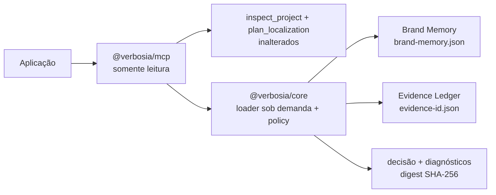

# Architecture Spine — Verbosia Brand Memory + Evidence Ledger

## Paradigma

**Núcleo determinístico schema-first em Ports and Adapters, com estado canônico versionado no repositório.** `@verbosia/core` contém modelo, resolução contextual e política; adaptadores locais carregam os documentos; `@verbosia/mcp` é uma porta somente leitura. IA pode analisar, mas não autoriza comunicação.

## Invariantes e decisões

### AD-1 — Herdar a boundary local do MCP [ADOPTED]

- **Binds:** servidor MCP, carregadores e qualquer caminho derivado.
- **Prevents:** raiz implícita, escape por symlink, rede, provider, Redis ou escrita durante análise.
- **Rule:** toda nova operação V1 exige raiz explícita e real, valida o diretório e revalida cada Brand Memory, evidence record e locator imediatamente antes da leitura; nenhum código first-party de análise inicia rede, escrita, provider ou Redis.

### AD-2 — Separar os quatro domínios de memória [ADOPTED]

- **Binds:** Translation Memory, Brand Memory, Market Signals e Evidence Ledger.
- **Prevents:** transformar sinais transitórios em tradução aprovada ou fato permanente.
- **Rule:** cada domínio mantém armazenamento, autoridade e ciclo de vida próprios; este slice implementa apenas Brand Memory e Evidence Ledger.

### AD-3 — Tornar o repositório a fonte de verdade [ADOPTED]

- **Binds:** persistência, revisão e futuras mutações.
- **Prevents:** banco ou índice derivado assumir autoridade e alteração não aprovada.
- **Rule:** arquivos versionados são canônicos; índices são descartáveis; toda mutação segue `draft -> validate -> approve -> apply`; CI rejeita modificação/remoção de evidence records existentes e exige aprovação para Brand Memory. Na V1, o runtime sempre emite `historyStatus: unverified` como diagnóstico sem alterar outcome; `verified` fica reservado para futura atestação assinada vinculada a repository revision e `stateDigest`.

### AD-4 — Usar armazenamento híbrido e ledger imutável [ADOPTED]

- **Binds:** `.verbosia/brand/brand-memory.json` e `.verbosia/evidence/<evidence-id>.json`.
- **Prevents:** ledger monolítico, edição retroativa e índice como fonte de verdade.
- **Rule:** Brand Memory vive em `join(projectRoot, '.verbosia/brand/brand-memory.json')`; cada evidência ocupa arquivo próprio e imutável sob `join(projectRoot, '.verbosia/evidence')`; correção cria novo registro com `supersedes`; um resolver próprio mantém esse estado separado do caminho legado da TM sob `outputDir`.

### AD-5 — Modelar Claim como entidade de autorização [ADOPTED]

- **Binds:** Brand Memory, Evidence Ledger e validação de conteúdo.
- **Prevents:** evidência aprovar comunicação automaticamente ou texto livre substituir identidade estável.
- **Rule:** Brand Memory é controlada pelo cliente e cobre, no mínimo, identidade/tom, públicos, serviços/ofertas, diferenciais, terminologia, restrições e referências aprovadas de Claims/provas; uso público requer Claim identificável, aprovado e sustentado por evidência atual aplicável ao contexto solicitado.

### AD-6 — Resolver contexto por overlays determinísticos [ADOPTED]

- **Binds:** tom, terminologia, CTA, exemplos, seleção de Claims e política editorial.
- **Prevents:** confundir idioma com mercado ou alterar fatos por adaptação local.
- **Rule:** resolver `base -> locale exato -> market exato -> pageIntent -> contentType -> channel -> audience`, sem herança implícita; cada seletor aponta no máximo um overlay. Overlays são patches tipados: `set` substitui apenas folhas estilísticas declaradas, coleções removíveis por ID usam `add/remove`, arrays nunca concatenam implicitamente e conflito na mesma precedência falha. Overlays apenas referenciam Claims globais existentes, nunca os criam ou mutam; fatos são imutáveis e restrições/compliance são somente aditivos.

### AD-7 — Avaliar evidência por dimensões explícitas [ADOPTED]

- **Binds:** modelo de evidência, política e diagnósticos.
- **Prevents:** pontuação opaca de confiança e promoção de sinal ou inferência a fato.
- **Rule:** avaliar `provenance`, `permission`, `supportRole`, `scope`, `validity` e `sensitivity`. `permission` é default-deny e declara `mode: claim_support|signal_only|prohibited`, `basis: owned|authorized|licensed|public_reference|restricted`, propósito, escopo, atestador, revisão, expiração e revogação; somente `claim_support` vigente e não restrita pode contribuir. Claim factual exige evidência `direct`; corroborativa, sinal, inferência ou hipótese nunca satisfazem sozinhos, e sensitivity controla exposição separadamente.

### AD-8 — Reservar autorização ao núcleo determinístico [ADOPTED]

- **Binds:** analisadores semânticos, claim policy e resultados.
- **Prevents:** modelo de IA conceder autorização editorial.
- **Rule:** adaptadores semânticos apenas extraem Claims e sugerem correspondências; o Core aplica exclusivamente a `PolicyDecisionTable` versionada deste spine e retorna `allow`, `allow_with_constraints`, `review_required` ou `block`, com reason codes fechados e referências auditáveis.

### AD-9 — Colocar o domínio no Core e o transporte no MCP [ADOPTED]

- **Binds:** limites de pacote e extensões futuras como CLI ou WordPress.
- **Prevents:** política duplicada em handlers e acoplamento do domínio ao protocolo MCP.
- **Rule:** Brand Memory, Evidence Ledger, claim policy e context resolution pertencem a `@verbosia/core`; `ResolvedBrandContext` e `ClaimValidationReport` são contratos provider-neutral exportados pela raiz pública do Core para composição futura com o planner; `@verbosia/mcp` valida I/O, invoca o Core e apresenta a resposta.

### AD-10 — Separar aprovação persistida de suporte calculado [ADOPTED]

- **Binds:** ciclo de vida de Claims e evidências.
- **Prevents:** estado `supported` ficar obsoleto após expiração ou substituição.
- **Rule:** Claim persiste apenas `draft`, `approved`, `suspended` ou `retired`, com ator/data de aprovação e revisão opcional; suporte é recalculado para `evaluationTime`. Tools MCP usam exclusivamente o clock UTC do processo e retornam o instante; injeção temporal existe apenas no Core para testes, e qualquer replay futuro é marcado `nonAuthoritativeReplay` e não autoriza publicação.

### AD-11 — Adicionar duas tools de leitura sem quebrar a fundação [ADOPTED]

- **Binds:** API MCP, compatibilidade e política de exposição.
- **Prevents:** remover tools entregues, derrubar projetos sem Brand Memory, mutação, aprovação, localização contextual prematura e leitura bruta do ledger.
- **Rule:** preservar sem alteração `verbosia.inspect_project` e `verbosia.plan_localization`; adicionar `verbosia.inspect_brand_context` e o nome canônico `verbosia.validate_claims`; carregar Brand Memory/Ledger sob demanda apenas nas novas operações. DTOs públicos usam allowlist fechada e nunca expõem `locator`, excerpt, atores ou metadados livres; erros e diagnósticos usam templates internos e referências opacas. O nome exploratório `verbosia.claim_validator` não cria alias na V1.

### AD-12 — Adotar contratos portáveis schema-first [ADOPTED]

- **Binds:** documentos canônicos, compatibilidade e tipos TypeScript.
- **Prevents:** divergência entre implementações Node/PHP e migração destrutiva silenciosa.
- **Rule:** usar JSON Schema Draft 2020-12 com `$schema`, `$id` absoluto/versionado, `additionalProperties: false`, required explícitos e sem ambiguidade entre ausente/null; `$ref` resolve apenas em registry empacotado, sem rede. Schemas cobrem documentos, contratos Core, diagnósticos e I/O das tools; tipos são derivados/verificados mecanicamente; `files`/`exports` e teste de tarball provam distribuição. Nenhuma implementação dependente inicia antes do merge dos schemas e golden fixtures.

### AD-13 — Minimizar e referenciar evidência [ADOPTED]

- **Binds:** ingestão, retenção e acesso a fontes.
- **Prevents:** arquivar reviews de terceiros, PII desnecessária, segredo ou fonte externa em tempo de validação.
- **Rule:** persistir descritor, locator, captura, source digest, permissão, escopo, validade e trecho mínimo sanitizado opcional; artefatos próprios são referenciados por caminho interno. O snapshot recalcula o digest do locator e `SOURCE_DIGEST_MISMATCH` coloca a evidência em quarentena; V1 não busca URL nem lê fora da raiz.

### AD-14 — Garantir identidade e integridade referencial [ADOPTED]

- **Binds:** Claims, evidências, nomes de arquivo e respostas reproduzíveis.
- **Prevents:** referências por posição/texto, IDs duplicados, dangling references, ciclos e resultado não reproduzível.
- **Rule:** IDs usam ASCII portátil validado por schema; `claimId` é estável/legível, `evidenceId` é opaco/imutável e coincide byte a byte com `<evidenceId>.json`; o Core rejeita violações e calcula `stateDigest`/`decisionDigest` em SHA-256 sobre preimages JCS/RFC 8785 definidos neste spine, nunca por concatenação de strings.

### AD-15 — Falhar fechado com isolamento por dependência [ADOPTED]

- **Binds:** carregamento, validação e diagnósticos.
- **Prevents:** estado malformado virar memória vazia e um registro isolado indisponibilizar Claims independentes.
- **Rule:** Brand Memory inválida, raiz insegura, schema incompatível, ID duplicado ou envelope de evidência ilegível falham a nova operação; payload inválido com envelope legível coloca seu componente em quarentena e afeta apenas Claims que o referenciam; erros discriminados são sanitizados pelo MCP sem stack, segredo ou caminho absoluto.

### AD-16 — Separar Context Packs comunitários da memória privada [ADOPTED]

- **Binds:** seam de extensão para idioma, SEO, GEO, mercado e cenário.
- **Prevents:** pack aprovar Claim, conter dados de cliente, enfraquecer governança ou executar código.
- **Rule:** packs futuros são declarativos, validados por schema, versionados, escopados, fundamentados e testados; V1 define apenas o contrato de composição, sem catálogo ou execução remota.

### AD-17 — Tornar regras e overrides auditáveis [ADOPTED]

- **Binds:** claim policy, Context Packs e futuras regras de localização, SEO e GEO.
- **Prevents:** heurística implícita, override silencioso e regra automática sem rastreabilidade.
- **Rule:** toda `PolicyRule` declara ID, versão, escopo, condição, severidade, evidências, recomendação, ação automática permitida, referência e testes. Override referencia `ruleId@version`, escopo, validade, justificativa e `approvalRef`; conflitos usam `most-restrictive-wins`. Boundary, schema, identidade/grafo, permission, sensitivity, PII/secrets e integridade não são sobrescrevíveis; automação apenas fortalece regras.

### AD-18 — Calibrar severidade editorial com revisão humana [ADOPTED]

- **Binds:** níveis de regra, outcomes e promoção de heurísticas.
- **Prevents:** regra linguística, SEO ou GEO não calibrada bloquear conteúdo válido.
- **Rule:** `informational` apenas informa, `warning` sempre produz `allow_with_constraints`, e `blocking` produz `block`; `review_required` ocorre somente nas condições explícitas da PolicyDecisionTable. Falhas intrínsecas de integridade/segurança bloqueiam imediatamente, mas regra editorial configurável só se torna blocking após concordância humana medida em fixtures representativas.

### AD-19 — Ler um snapshot estável [ADOPTED]

- **Binds:** adaptador de arquivos, boundary de raiz e digests.
- **Prevents:** TOCTOU, troca de symlink e decisão calculada sobre mistura de versões.
- **Rule:** enumerar deterministicamente, abrir cada arquivo após revalidação de boundary, ler pelo handle e comparar `fstat` antes/depois, raw SHA-256 e identidade platform-specific do handle com o path resolvido; revalidar também o hash da listagem do diretório. Qualquer mudança permite no máximo uma nova tentativa e depois falha com `STATE_CHANGED_DURING_READ`; kernel/admin hostil fica fora do threat model local V1.

### AD-20 — Fechar a semântica de supersession [ADOPTED]

- **Binds:** grafo do Evidence Ledger, aprovação e quarentena.
- **Prevents:** forks, fallback silencioso, herança de permissão ou substituição que amplie autorização.
- **Rule:** `supersedes` forma cadeia linear successor→predecessor, sem dangling edge, fork ou ciclo; successor é completo e não herda escopo/permissão. No seu `validFrom`, o predecessor deixa de ser ativo; Claims continuam referenciando IDs exatos e exigem reaprovação explícita para usar o successor. Violação coloca todo o componente em quarentena.

## Contratos normativos

### PolicyDecisionTable v1

Avaliar na ordem abaixo; falha intrínseca prevalece sobre regra editorial e o agregado usa `block > review_required > allow_with_constraints > allow`.

| Condição | Resultado |
| --- | --- |
| Raiz insegura, schema major incompatível, ID duplicado ou envelope ilegível | falha da operação |
| Claim desconhecido ou ambíguo | `review_required` |
| Claim `suspended` ou `retired`, proibição conhecida ou policy blocking calibrada | `block` |
| Claim `draft` | `review_required` |
| Claim aprovado sem evidência direta, ativa, permitida e aplicável | `review_required` |
| Claim aprovado e sustentado, com warning | `allow_with_constraints` |
| Claim aprovado e sustentado, sem restrição | `allow` |

Evidência é ativa quando `validFrom <= evaluationTime < validUntil`; `validUntil` ausente significa limite aberto. Suporte exige `permission.mode=claim_support`, permission vigente/não revogada/não restrita, `supportRole=direct` e correspondência exata de toda dimensão de escopo presente; escopo ausente significa global, sem wildcard. Registro ausente, expirado, indisponível, insuficiente ou em quarentena nunca gera fallback. `validate_claims` devolve um resultado por candidato na ordem recebida, mais outcome agregado; Claim ID duplicado na entrada é inválido.

### Schemas públicos obrigatórios

O contrato-first entrega schemas versionados para `BrandMemory`, `EvidenceRecord`, `ResolvedBrandContext`, `PolicyRule`, `ClaimValidationRequest`, `ClaimValidationReport`, `Diagnostic`, `ContextPackContribution` e inputs/outputs das duas tools novas. Reason codes são vocabulário fechado; respostas stdio golden são o contrato observável. Diagnósticos e referências usam `(severityRank, code, relativePath, jsonPointer, claimId, evidenceId)`, com campos ausentes como string vazia e comparação bytewise UTF-8 após NFC.

### Preimages de integridade

- `stateDigest = SHA256(JCS({ contractVersion, schemaVersions, policyVersion, policyEngineVersion, brandMemory, evidence }))`; `policyEngineVersion` é versão lógica cross-language, nunca versão de package, build ou runtime.
- `evidence` contém todos os arquivos descobertos ordenados por `evidenceId`; registro válido usa valor canônico, e payload em quarentena usa `{ relativePath, evidenceId, status, rawSha256 }`.
- `DecisionBody` é a projeção normalizada do resultado sem `decisionDigest`, outros digests ou metadata operacional; `decisionDigest = SHA256(JCS({ contractVersion, stateDigest, normalizedRequest, evaluationTime, policyEngineVersion, decisionBody }))`.
- Normalização aplica Unicode NFC ao request, casing canônico BCP-47, paths relativos com `/`, defaults explícitos, sets ordenados/deduplicados, sequências preservadas e UTC RFC 3339 com milissegundos.

## Convenções de consistência

| Aspecto | Convenção |
| --- | --- |
| Arquivos canônicos | JSON UTF-8 com newline final e ordenação determinística na serialização. |
| Ingestão JSON | Validar bytes UTF-8/I-JSON antes do parse; rejeitar chave duplicada, lone surrogate e número não interoperável; inteiro fora de `±(2^53−1)` usa string. |
| Campos e tools | Campos `camelCase`; tools namespaced em `verbosia.snake_case`; reason codes em `UPPER_SNAKE_CASE`. |
| Locale e contexto | Locale BCP-47; locale, mercado, canal e público são campos separados. |
| Contexto decisório | `locale`, `market`, `pageIntent`, `contentType` e `editorialRisk` são campos separados; canal e público são dimensões adicionais. |
| Tempo | Datas e instantes em ISO 8601; validade nunca vem de `mtime`; o clock é injetável no Core para testes, mas o MCP usa UTC do processo e retorna `evaluationTime`. |
| IDs | `claimId` legível e estável; `evidenceId` opaco e imutável; referências somente por ID. |
| Integridade | `stateDigest` e `decisionDigest` usam `sha256:<hex-lowercase>` sobre JSON canônico JCS/RFC 8785; vetores de teste devem coincidir entre Node e PHP. |
| Diagnósticos | Código estável, severidade, caminho relativo à raiz, JSON Pointer e remediação; sem stack, segredo ou trecho restrito. |
| Contratos | `schemaVersion` nos documentos e versão de contrato nas respostas MCP; compatibilidade maior falha fechada. |
| Compatibilidade MCP | As duas tools novas são aditivas; nomes, outputs e erros das duas tools legadas permanecem inalterados. |
| Formats | `format` de JSON Schema nunca basta como anotação; Core valida semanticamente RFC 3339, URI e BCP-47 com fixtures equivalentes em Node/PHP. |

## Stack verificado

| Tecnologia | Versão |
| --- | --- |
| Node.js | alvo `>=22.0.0` na próxima release Core/MCP; CI em Node 22 e 24 LTS; runtime local `22.22.3` |
| pnpm | `10.33.2` |
| TypeScript | `5.9.3` no lockfile |
| JSON Schema | Draft `2020-12`, publicação oficial corrente em 2026-08-27 |
| Canonicalização JSON | JCS, RFC `8785`, verificado no RFC Editor em 2026-08-27 |
| `@modelcontextprotocol/server` | `2.0.0` no lockfile |
| Zod | `4.4.3` no lockfile; restrito à boundary MCP existente |

Nenhuma biblioteca de validação JSON Schema, banco de dados ou provider semântico é vinculada por este spine. Os engines históricos Node 18/20 são compatibilidade herdada EOL, não suporte futuro; sua migração ocorre junto da release deste slice.

## Estrutura inicial

```text
packages/core/
├── schemas/
│   ├── brand-memory.schema.json
│   ├── evidence-record.schema.json
│   ├── policy-rule.schema.json
│   ├── resolved-brand-context.schema.json
│   ├── claim-validation.schema.json
│   ├── diagnostic.schema.json
│   └── context-pack-contribution.schema.json
└── src/
    ├── brand-memory/          # modelo, loader e overlays
    ├── evidence-ledger/       # registros, supersession e quarentena
    ├── claim-policy/          # decisão determinística e reason codes
    ├── context-resolution/    # composição e digest canônico
    └── context-packs/         # somente contrato de composição V1

packages/mcp/src/
├── service.ts                 # orquestração read-only do Core
└── server.ts                  # schemas de I/O e registro das tools

.verbosia/
├── brand/brand-memory.json
└── evidence/<evidence-id>.json
```

Os diretórios acima são internos e reexportados por `packages/core/src/index.ts`; não constituem subpath imports públicos. Todos os schemas públicos acima são exceções e possuem exports estáveis no pacote publicado.



## Mapa de capacidades → arquitetura

| Capacidade / área | Localização | Governada por |
| --- | --- | --- |
| Carregar Brand Memory | `@verbosia/core/brand-memory` + adapter de arquivo | AD-3, AD-4, AD-12, AD-15 |
| Resolver overlays | `@verbosia/core/context-resolution` | AD-6, AD-14 |
| Carregar e avaliar evidências | `@verbosia/core/evidence-ledger` | AD-7, AD-10, AD-13, AD-15 |
| Autorizar Claims | `@verbosia/core/claim-policy` | AD-5, AD-8, AD-10 |
| Inspecionar contexto | `verbosia.inspect_brand_context` | AD-1, AD-9, AD-11 |
| Validar Claims | `verbosia.validate_claims` | AD-7, AD-8, AD-11, AD-15 |
| Context Packs | contrato em `@verbosia/core/context-packs` | AD-2, AD-16 |
| Compor com localização futura | `ResolvedBrandContext` + `ClaimValidationReport` | AD-6, AD-9, AD-18 |
| Regras e overrides | `PolicyRule` + trilha de override | AD-17, AD-18 |
| Snapshot estável | adapter de arquivo do Core | AD-1, AD-19 |
| Supersession | grafo do Evidence Ledger | AD-10, AD-20 |

## Envelope operacional e ambiental

- Processo local MCP por `stdio`, Node.js 22+, raiz explícita e sem transporte remoto; a release do slice eleva Core e MCP em conjunto.
- V1 não usa banco, rede, OAuth, provider de IA, Redis, conectores de mercado ou publicação externa.
- Todas as leituras, inclusive artefatos referenciados, passam pela mesma boundary de raiz e symlink da fundação MCP.
- Brand Memory e Ledger são carregados apenas pelas duas novas tools; sua ausência ou invalidade não afeta as tools legadas.
- `verbosia.config.js/mjs` é código local confiável executado pelo projeto; a garantia de ausência de efeitos cobre código first-party de análise, não sandboxing do módulo de configuração.
- Tools são idempotentes e read-only; `stdout` permanece exclusivo ao protocolo e logs operacionais vão para `stderr`.
- Saídas são determinísticas para o mesmo conjunto de arquivos, request normalizado, `evaluationTime` e versão de contrato.
- Evidência restrita contribui para decisão sem aparecer na resposta; indisponibilidade que exija reverificação produz `review_required`.
- Índices podem existir apenas como cache reconstruível fora da autoridade canônica e não são produzidos pelas tools V1.
- Estado e qualquer cache futuro são namespaced pela identidade do `real projectRoot + stateDigest` e nunca compartilhados entre raízes; V1 não produz cache novo.
- Limites V1 centralizados e não alteráveis pelo request: Brand Memory 1 MiB, cada evidence record 256 KiB, ledger 10.000 registros/64 MiB, 100 Claims por validação, cadeia `supersedes` 100 e 1.000 diagnósticos; exceder falha com código estável.
- `editorialRisk` efetivo é o máximo entre request e mínimos da Brand Memory para `pageIntent/contentType`; desconhecido assume risco máximo, e o caller só pode elevar o nível.
- Context Packs não são carregados nem executados na V1; somente `ContextPackContribution` provider-neutral é publicado para composição futura.
- Nenhum resultado promete posição, tráfego ou presença em SEO/GEO; outcomes expressam conformidade com regras e evidências, não garantia de ranking.
- Schemas são carregados do pacote por `fs`/`import.meta.url` ou módulo gerado, nunca por import JSON estático; resolução `$ref` permanece offline.
- A configuração TypeScript atual pode permanecer se smoke tests dos tarballs provarem Node ESM real; caso contrário, a implementação deve migrar para `NodeNext` antes da publicação.

### Aceitação pós-implementação

- Preservar integralmente os testes e contratos das tools legadas; o teste stdio deve exigir o conjunto aditivo de quatro tools.
- Provar no tarball publicado a presença e resolução de todos os JSON Schemas públicos.
- Instalar tarballs e validar imports públicos, schemas e MCP `stdio` em Node 22 e 24.
- Cobrir symlink no diretório, em evidence record e em locator interno, além de zero escrita/rede/provider/Redis no código first-party.
- Simular troca concorrente de arquivo/symlink e exigir snapshot consistente ou `STATE_CHANGED_DURING_READ`.
- Testar CI add-only para evidências, reaprovação em supersession, envelopes ilegíveis e componentes em quarentena.
- Validar vetores I-JSON/JCS, preimages e digests idênticos em Node e PHP.
- Rodar scanner de segredos/PII nos arquivos canônicos e canary tests contra vazamento em `text`, `structuredContent`, `stderr` e erros MCP.
- Cobrir permissões expiradas/revogadas/restritas, locator digest divergente, override conflitante e downgrade de `editorialRisk`.
- Manter fixtures com erros intencionais em `pt-BR`, `en-US` e `es-419`; uma regra editorial só pode tornar-se blocking após concordância humana medida nessas fixtures.
- Quando o usuário fornecer um cenário realista, executar loop E2E até convergência, cobrindo correção, coerência, rastreabilidade, segurança, determinismo e regressões; todo defeito produz correção e teste permanente.

## Deferred — decisões adiadas

| Decisão adiada | Condição de revisão |
| --- | --- |
| Biblioteca runtime de JSON Schema e pipeline schema→TypeScript | Antes da implementação do loader; selecionar com prova de Draft 2020-12, ESM, Node 22/24, registry `$ref` offline e tipos sem divergência. |
| Escrita, aprovação e migração assistida via MCP | Após o fluxo por PR demonstrar auditoria suficiente e existirem autenticação, autorização, concorrência e rollback definidos. |
| `verbosia.localize_with_context` | Após estabilizar contratos e reason codes das duas tools V1 e cobrir fixtures multilíngues. |
| Provider semântico para extração/matching | Quando Claims explícitos forem insuficientes; exigir adapter opcional, avaliações de ambiguidade e nenhuma autoridade editorial. |
| Banco ou índice persistente | Somente se medições mostrarem que leitura de arquivos não atende volume/latência ou houver concorrência de escrita autorizada. |
| Catálogo/registry de Context Packs e precedência entre packs | Após publicar schema, fixtures, governança de contribuição e testes de conflito; packs continuam declarativos. |
| Market Signals, conectores, OAuth e fontes externas | Em iniciativa separada com políticas vigentes, consentimento, TTL, minimização e isolamento entre clientes. |
| Transporte remoto e multi-tenant | Apenas com modelo explícito de identidade, autorização, isolamento, rate limiting e observabilidade. |
| Assinatura criptográfica/autoria do ledger | Quando a política Git/CI for insuficiente; definir chaves, rotação, verificação e recuperação sem alegar retroativamente autoria na V1. |
| Loop E2E com cenário real do usuário | Após concluir a implementação e receber o cenário; torná-lo gate de aceitação iterativo e converter cada defeito em teste de regressão permanente. |
